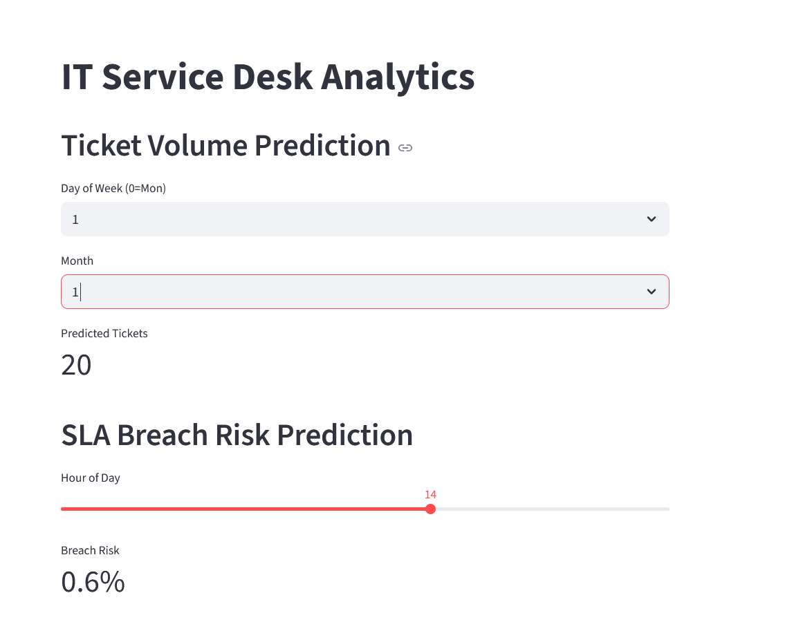
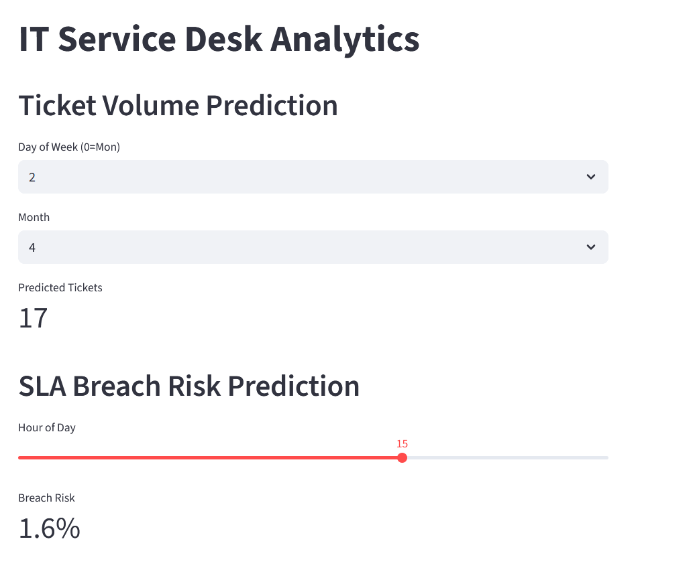

# IT Service Desk Analytics System

## Overview
This project analyzes service desk tickets and builds machine learning models to support IT operations.

## Business Problems
- Ticket volumes fluctuate, making staffing difficult
- SLA breaches reduce user productivity and service quality

## What I Built
### 1) Ticket Volume Prediction (Regression)
Predicts expected daily ticket volume for better workforce planning.

### 2) SLA Breach Risk Prediction (Classification)
Predicts the probability that a ticket will breach SLA to support proactive escalation.

## Tech Stack
Python, Pandas, NumPy, Scikit-learn, Matplotlib/Seaborn, Streamlit

## How to Run
### Install
```bash
pip install -r requirements.txt


## 📸 Demo




---

## 💡 Impact
This solution can help IT teams:
- Improve staffing decisions  
- Reduce SLA breaches  
- Identify common incident drivers  

---

## 👨‍💻 Author
Daniel Diala  
GitHub: https://github.com/dd4real2k
